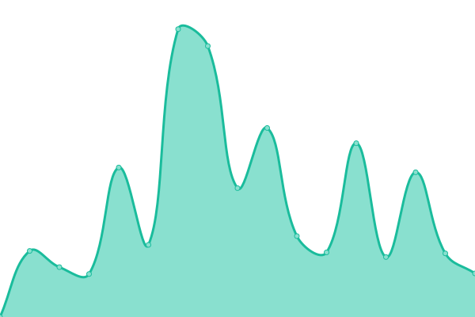
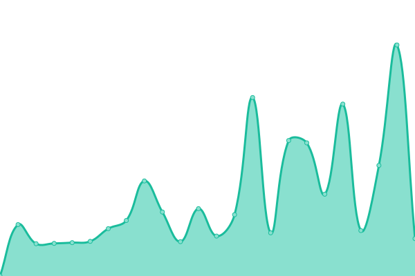

# [📈 Live Status](https://fedry.github.io/webmon): <!--live status--> **🟧 Partial outage**

This repository contains the open-source uptime monitor and status page for [Fedry Kemilau](https://fedry.github.io/webmon), powered by [Upptime](https://github.com/upptime/upptime).

With [Upptime](https://upptime.js.org), you can get your own unlimited and free uptime monitor and status page, powered entirely by a GitHub repository. We use [Issues](https://github.com/fedry/webmon/issues) as incident reports, [Actions](https://github.com/fedry/webmon/actions) as uptime monitors, and [Pages](https://fedry.github.io/webmon) for the status page.

<!--start: status pages-->
<!-- This summary is generated by Upptime (https://github.com/upptime/upptime) -->
<!-- Do not edit this manually, your changes will be overwritten -->
<!-- prettier-ignore -->
| URL | Status | History | Response Time | Uptime |
| --- | ------ | ------- | ------------- | ------ |
|  [Passion Designs](https://passiondesigns.co.id) | 🟩 Up | [passion-designs.yml](https://github.com/fedry/webmon/commits/HEAD/history/passion-designs.yml) | 

 3437ms
     
 | 

<a href="https://fedry.github.io/webmon/history/passion-designs">98.85%</a>
    

|  [Tao TSM](https://taotsm.org) | 🟥 Down | [tao-tsm.yml](https://github.com/fedry/webmon/commits/HEAD/history/tao-tsm.yml) | 

 5353ms
     
 | 

<a href="https://fedry.github.io/webmon/history/tao-tsm">99.43%</a>
    

|  [YDPMTI](https://ydpmti.org) | 🟩 Up | [ydpmti.yml](https://github.com/fedry/webmon/commits/HEAD/history/ydpmti.yml) | 

 1971ms
     
 | 

<a href="https://fedry.github.io/webmon/history/ydpmti">100.00%</a>
    

|  [Penzstar](https://penzstar.com) | 🟩 Up | [penzstar.yml](https://github.com/fedry/webmon/commits/HEAD/history/penzstar.yml) | 

 5900ms
     
 | 

<a href="https://fedry.github.io/webmon/history/penzstar">99.74%</a>
    

|  [Kemilau](https://kemilau.net) | 🟥 Down | [kemilau.yml](https://github.com/fedry/webmon/commits/HEAD/history/kemilau.yml) | 

 919ms
     
 | 

<a href="https://fedry.github.io/webmon/history/kemilau">0.00%</a>
    

<!--end: status pages-->

[**Visit our status website →**](https://fedry.github.io/webmon)

## 📄 License

- Powered by: [Upptime](https://github.com/upptime/upptime)
- Code: [MIT](./LICENSE) © [Fedry Kemilau](https://fedry.github.io/webmon)
- Data in the `./history` directory: [Open Database License](https://opendatacommons.org/licenses/odbl/1-0/)
